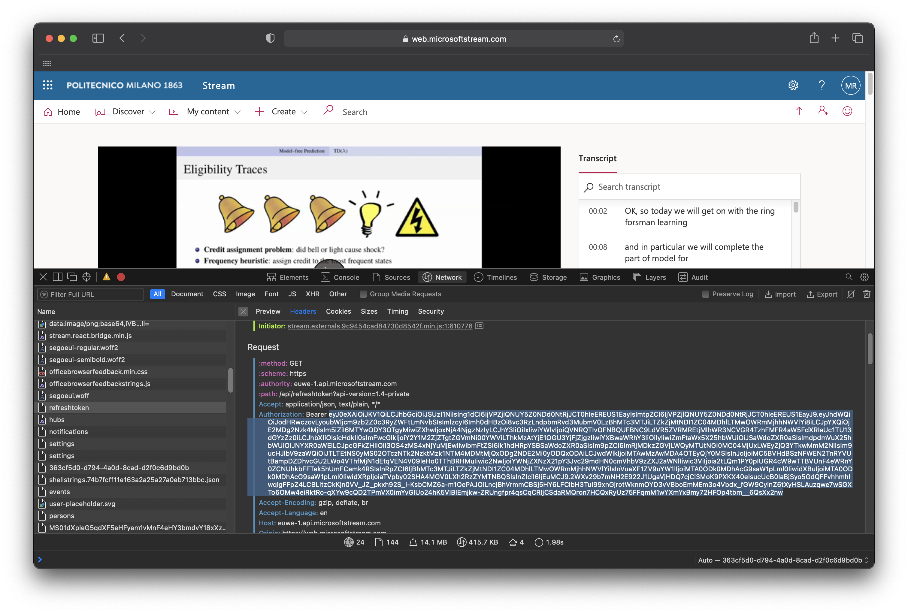
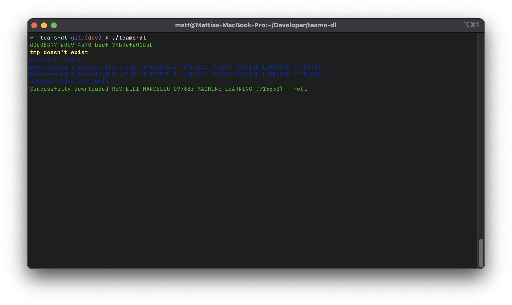

# teams-dl
Bash-flavored multi-process script tool that will download Microsoft Teams meetings hosted on Microsoft Stream

Inspired by [snobu/destreamer](https://github.com/snobu/destreamer) and [sup3rgiu/MStreamDownloader](https://github.com/sup3rgiu/MStreamDownloader) but faster with aria2 and multiprocessing

## Prerequisites
- Linux, macOS (this has not been tested on Windows)
- [`jq`](https://github.com/stedolan/jq)
- [`ffmpeg`](https://github.com/FFmpeg/FFmpeg)
- [`aria2`](https://github.com/aria2/aria2)

## Commands
```
Usage: teams-dl [ -f links_file ] [ -tf ticket_file ] [ -t ticket ] [ -i links ]

       Command summary:
       -f, --file             Use links contained in file
       -t, --ticket           Input ticket from command line
       -tf, --ticket-file     Use ticket contained in file
       -i                     Input links from command line and don't use file input
       -p                     Launches specified number of processes
       -o                     Download videos in specified folder
       -v                     Output verbose logs
       -h, --help             Print info about the program
```

## How to use
The best way you can use this tool

1. Move to the tool's folder
2. Put your teams meeting links in `links.txt` (each link on a single line)
3. Get the value of the **Authorization Bearer** using the **networking** tab
    
    - This is needed to access private videos that requires login credentials
4. Put the value of the Authorization Bearer in `token`
5. Execute this command

```sh
$ teams-dl -tf token -f links.txt
```
You can also provide links directly from command line

```sh
$ teams-dl -tf ticket.txt -i link1 link2 link3 ...
```
And you can also pass the ticket directly from command line

```sh
$ teams-dl -t ticket_value -i link1 link2 link3 ...
```

If everything executes correctly you will get something similar to this


## Multiprocess
### Disclaimer
This tool can run multiple downloads in parallel by using multiprocessing, this feature is intended only for people that have a good internet connection.

You can specify how many parallel downloads you want by using the `-p` command flag

This command will download 5 meetings concurrently

```sh
$ teams-dl -tf ticket.txt -f links.txt -p 5
```