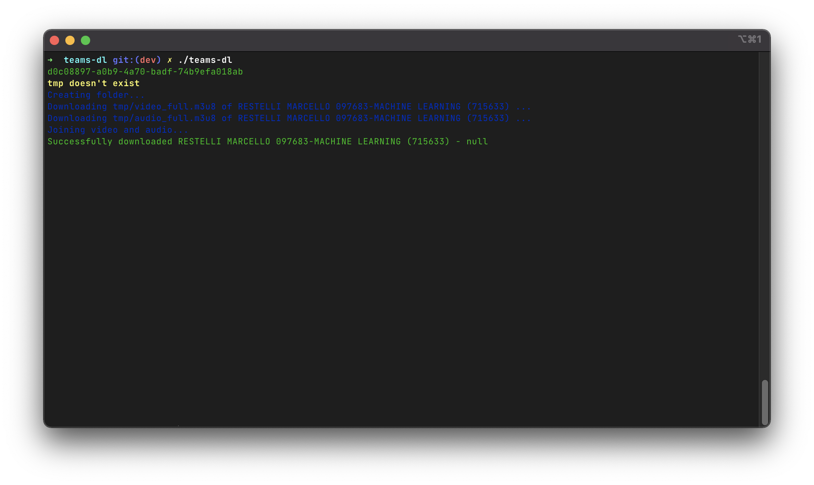

# teams-dl
This script will download Teams Meetings locally

Inspired by [snobu/destreamer](https://github.com/snobu/destreamer)

## Prerequisites
- Linux, macOS (this has not been tested on Windows)
- [`jq`](https://github.com/stedolan/jq)
- `ffmpeg`

## How to use
The best way you can use this tool

1. Move to the tool's folder
2. Put your teams meeting links in `links.txt` (each link on a single line)
3. Get the value of the **Authorization Bearer** using the **networking** tab
    
    - This is needed to access private videos that requires login credentials
4. Put the value of the Authorization Bearer in `token`
5. Execute this command

```sh
$ teams-dl
```

If everything executes correctly you will get something similar to this
